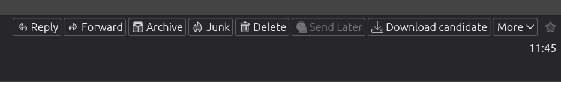
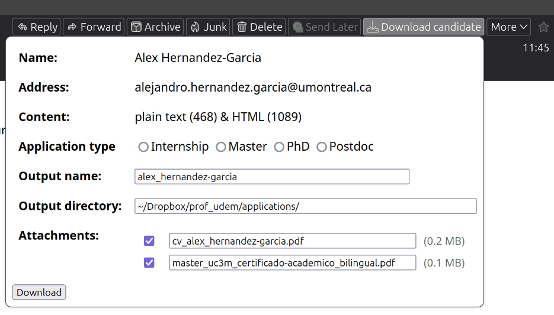
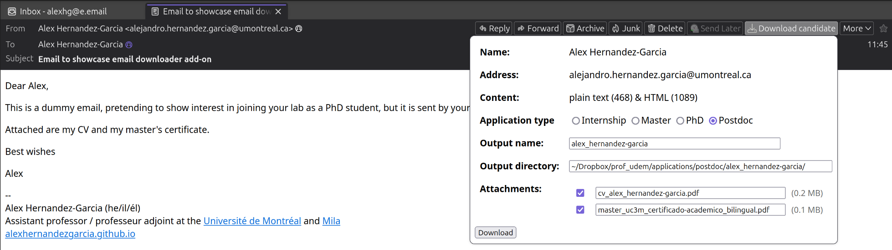

This is a custom add-on created to automatise the task of downloading information from emails sent by students or postdocs interested in joining the research group. The add-on adds a new button "Download candidate" to the email tabs, which on clicking it displays the sender name, email address and attachments from the email, as well as a button to download. When clicked, the add-on creates a ZIP file with the information from the email and downloads it at the location selected by the user.

The ZIP file contains the following files:
- `name.txt`: The name of the sender.
- `address.txt`: The email address of the sender.
- `email.txt`: The email content as plain text, if successfully retrieved.
- `email.html`: The email content as HTML, if it has an HTML version and it is successfully retrieved.
- `outputdir.txt`: The output directory that could be used to move the extracted directory. 
- Attached files

The add-on allows the user to select whether the candidate is applying for an internship, a Master, a PhD or postdoc. Furthermore, it allows to edit output name for the ZIP file and the output directory. By default, the output name is a lower case version of the sender name with the spaces replaced by underscores.

Screenshots of the add on:

  

  

  

